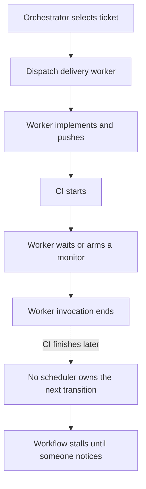
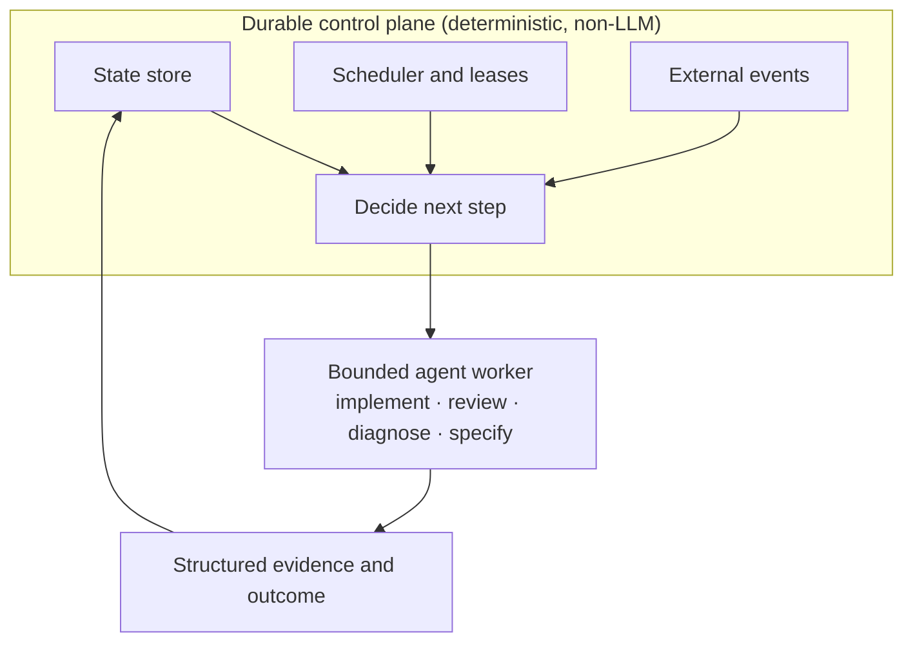
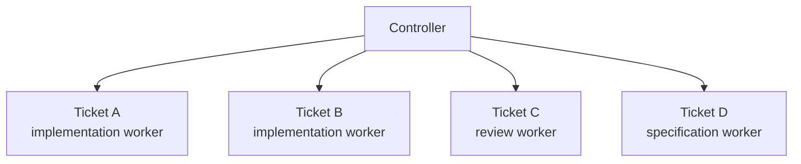
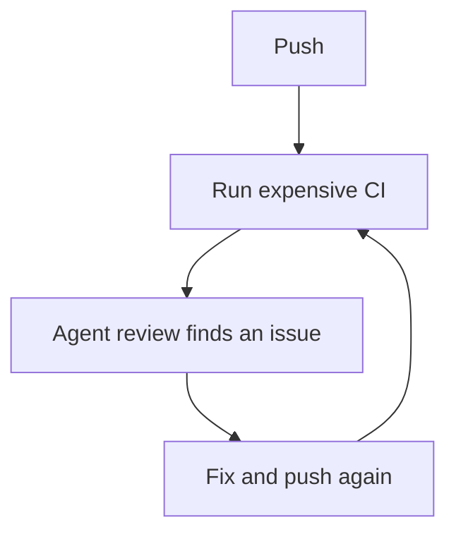
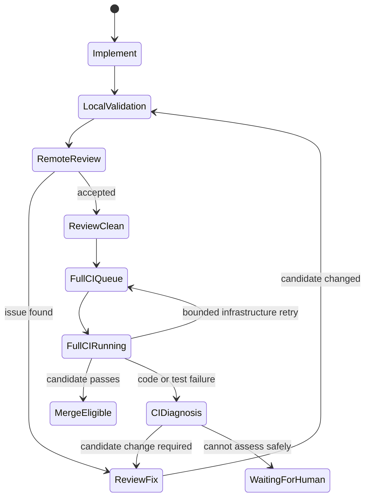
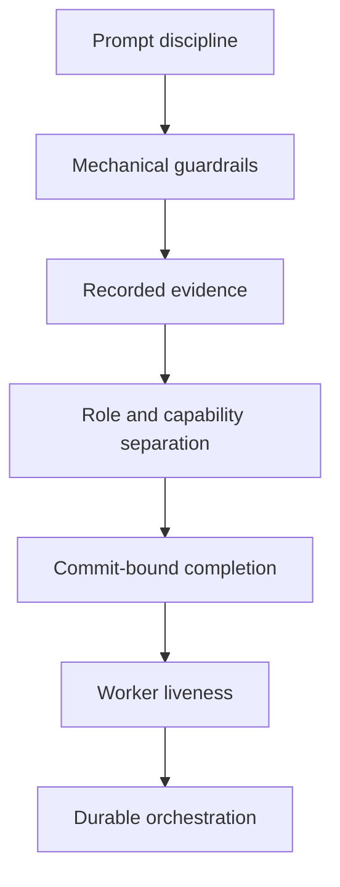

# From conversational loop to durable controller

> **Implementation status, verified 2026-08-31.** The observe-only Phase 1 controller described here is implemented and running on a timer on a real host. It persists decisions but cannot dispatch workers. The merge-join executor is exercised in dry-run mode behind a backend that refuses to merge. Later phases remain work in progress. This article separates those shipped boundaries from the target architecture.

## The short version

Mechanical guardrails around agent work are necessary, but they are not sufficient if the workflow executing those guardrails depends on one long-lived conversation remembering to continue.

The harness originally concentrated on governing what agents did:

- acceptance contracts;
- deterministic gates;
- commit-bound review evidence;
- credential-isolated reviewers;
- three-outcome checks;
- diff budgets;
- eval ledgers;
- worker heartbeats.

Those mechanisms remain useful.

The operational system later exposed a different class of failure: **workflow liveness itself was conversational**. An orchestrator had to remember to re-arm its next wake-up, subagents could wait on CI and never get re-entered after the wait, and a crash could take the scheduler and its in-session watchdog down together.

The resulting architectural rule is:

> **An agent may decide how to perform a workflow transition. It should not be the durable authority deciding whether the workflow continues.**

That responsibility belongs to deterministic software with persisted state.

## What changed in our understanding

The earlier work focused on a valid problem: an agent can be fluent and wrong while reporting green. The answer was to make claims mechanically checkable and to separate authoring capability from review capability.

That did not address a different question:

> If the current agent process or conversation disappears, who knows what should happen next?

For a simple interactive coding session, "the human restarts it" is a perfectly reasonable answer. For an autonomous delivery loop, it is not.

A system that can prove its checks but cannot reliably resume the workflow after a wait or crash is governed but not durable.

## The failure pattern

A representative shape looked like this:



A heartbeat does not fix that.

The worker may have reported a healthy heartbeat before it yielded. What is
missing is **workflow durability across worker boundaries**, not worker
liveness.

That distinction matters enough to state explicitly:

| Mechanism | Question it answers |
|---|---|
| heartbeat | Is worker X still plausibly doing task Y? |
| controller | What workflow transition should happen next? |

Conflating the two produces increasingly elaborate watchdogs around a conversational scheduler.

## The revised architecture



The controller owns state, retries, external waits, work leases, timeouts and concurrency. Agents perform bounded transitions and return structured outcomes.

A worker becomes disposable. If it disappears, the workflow state remains.

## What Phase 1 now proves

The first implementation is a standalone, project-neutral package with a project
adapter on the far side of a narrow interface. One bounded invocation:

1. reconciles external ticket and pull-request state;
2. recovers expired leases;
3. calculates runnable transitions under named capacity pools; and
4. persists `WOULD_DISPATCH` or `HOLD` decisions in SQLite.

Each instance has separate configuration, state and logs. A per-instance lock
refuses concurrent ticks, and every command uses the same three outcomes: clean,
a real verdict, or could-not-assess. A systemd timer now runs that bounded tick on
a real host. The installation exposed useful operational failures—adapter
dependencies, service environment and filesystem ownership—and each failed
loudly rather than being read as a clean observation.

The important limitation is enforced in configuration, not left to prose:

```toml
dispatch_mode = "observe"  # "automatic" is refused in Phase 1

[pools]
implement = 4
review = 2
```

A separate merge-join executor now consumes a SHA-pinned plan and journals each
obligation so a retry does not repeat an effect. Changed evidence stops the plan.
For now its only writing backend refuses to merge, and the repository bridge runs
it as a dry run. This proves idempotency and stale-evidence handling without
quietly granting the controller merge authority.

Phase 1 therefore proves durable observation and decision recording. It does not
yet prove agent dispatch, automatic retries around workers, model-routing
enforcement or unattended merging.

## This still supports parallel agents

Moving orchestration out of the conversation does **not** imply serial execution.

It gives concurrency somewhere explicit to live:



Each worker can run in an isolated worktree and test environment. The controller
owns the leases and capacity limits.

This also separates highly parallel, cognition-heavy work from scarce
infrastructure whose capacity must be bounded.

For example:

| Capacity pool | Slots |
|---|---:|
| implementation | 4 |
| review | 4 |
| full CI | 2 |
| merge | 1 |

This is backpressure, not a lack of autonomy.

## The review/CI cascade made the boundary visible

The same architecture problem appeared in a different form around CI.

The delivery loop had evolved toward:



The first mitigation was to review locally before the first push. That is sound, but the stronger design is to make the workflow phases explicit:



The controller can keep review convergence cheap and admit only a review-clean
candidate to the expensive suite. If full CI exposes a product or test problem,
the workflow returns through diagnosis, correction, local validation and review.
A changed commit never inherits the earlier review-clean state. Infrastructure
failures may return directly to the CI queue under a bounded retry policy; an
unclassifiable result fails closed rather than being treated as a pass.

This is difficult to express reliably when the orchestration state exists mostly as instructions inside one ongoing conversation. It becomes straightforward when the states are data.

## What changed in reviewer identity enforcement

The earlier [double-loop case study](enforcing-the-double-loop-for-agents.md)
separates credential isolation, fresh context and model or persona separation.
The rearchitecture did not overturn that distinction. It exposed a narrower flaw
in how credential isolation had been enforced: an exact GitHub login string had
been treated as stable proof of reviewer authority.

**A literal login string is too weak to prove that authority.** The same GitHub App
can appear differently across API surfaces—as a bare name, with a bot suffix or in
an App-specific form. A gate tied to one exact spelling can silently stop enforcing
the intended boundary while still looking secure.

The stronger language is:

> Review evidence is trusted because it was produced by a capability the author does not possess, its provenance can be verified, and it is bound to the exact commit being judged.

The login is audit metadata. The capability/provenance is the security property.

This does not weaken the argument for reviewer isolation; it makes it more precise.

## Rule-based model routing adds diversity, not independence

Before the durable-controller work, the harness selected a model tier from rules
about the activity being performed. The policy considered factors such as whether
the work was routine implementation, orchestration, investigation or review. It
did not permanently assign one named model to all coding and another to all
reviews.

During the period described here, those rules commonly routed routine
implementation to Sonnet and higher-reasoning orchestration or review work to
Opus. These names describe the configuration used at the time, not an
architectural requirement. The routing rules could select different models as
their capabilities, costs or the risk of the activity changed.

The policy was not perfectly enforced. Model inheritance and sub-dispatch
occasionally selected a different tier from the one the activity rules required,
and the ledger did not always preserve the complete dispatch chain. The
historical record therefore contains a mixture of fresh-context review and
deliberate model-tier separation rather than one uniform reviewer configuration.

Each layer contributes something different:

| Review layer | What it adds |
|---|---|
| deterministic tools | repeatable mechanical verification |
| fresh-context reviewer using the same configured tier | another pass without the author's conversation history |
| reviewer routed to a different or stronger tier | context separation plus model-tier diversity |
| reviewer from a different model family or provider | broader reasoning diversity |
| credential-isolated reviewer | authority the author cannot forge; not reasoning independence |
| human reviewer | independent authority and judgement |

A reviewer selected under a higher-reasoning rule can find defects the
implementation model missed, and the recorded reviews show that this happened.
It is still not automatically an independent audit: models from the same family
may share blind spots. The review should be retained when its measured yield
justifies its cost, with the routing decision, actual model, role and evidence
recorded.

The durable controller should preserve the **routing policy**, not the historical
Sonnet/Opus pairing. Model selection belongs in configurable rules based on the
transition, activity and risk class. Phase 1 does not dispatch workers, so it
neither removes nor proves this policy. The worker-dispatch phase must evaluate
the rules explicitly, prevent accidental inheritance, and record both the
requested and actual model.

## The human boundary becomes risk-based

A durable controller makes human intervention easier to model explicitly rather than leaving it as an accidental stall.

One useful policy shape is:

| Risk class | Example | Human approval |
|---|---|---|
| low | docs, tests, internal tooling | normally no |
| ordinary | product code with established deterministic evidence | potentially no |
| high | auth, security, migrations, unattended actions | yes |
| control plane | scheduler, gates, reviewer policy, identity, CI/deploy policy | mandatory |

The last class matters most.

An autonomous system should not be able to weaken the rules that judge a change and immediately benefit from the weakened rule. A control-plane PR should be evaluated under the **base branch's** policy and require stronger authority.

That is not a temporary compromise on the road to "full autonomy". It is a
trust boundary.

## What the earlier deep dives still support

This is the third article in the series. The two earlier articles make different,
but related, claims:

| Claim retained after the rearchitecture | Earlier source |
|---|---|
| An agent's green result is not enough evidence, and the acceptance contract must remain open to challenge. | [Governing the double loop](enforcing-the-double-loop-for-agents.md) |
| Review evidence should be bound to the exact commit, and author and reviewer capabilities should be separated when review is a gate. | [Governing the double loop](enforcing-the-double-loop-for-agents.md) |
| A second agent can add a useful review layer without becoming an independent audit. | [Governing the double loop](enforcing-the-double-loop-for-agents.md) |
| Missing evidence must remain `could-not-assess`, never silently become a pass or a zero. | [Evals for an agent loop](honest-evals-for-an-agent-loop.md) |
| Overrides, denominators and who caught each mistake must be recorded if the metrics are to mean anything. | [Evals for an agent loop](honest-evals-for-an-agent-loop.md) |
| Deterministic evidence is stronger than an agent's self-report. | [Governing the double loop](enforcing-the-double-loop-for-agents.md) and [Evals for an agent loop](honest-evals-for-an-agent-loop.md) |

Those claims concern how agent work is governed and measured. The rearchitecture
changes a different concern: **where workflow state, scheduling and recovery
belong**. Moving those responsibilities into a durable controller does not make
the earlier controls less useful.

## What the heartbeat pattern now means

The companion cookbook heartbeat pattern remains useful, but with a narrower contract:

> Heartbeats monitor or renew **worker leases**. They do not provide **workflow durability**.

If a worker is doing a 20-minute local test run, a deadline-based beat is useful evidence that its lease should remain valid.

If the workflow is waiting for an external CI run, the worker should normally return. The controller records `FULL_CI_RUNNING` and the run ID. No conversational heartbeat should be required to make the post-CI transition happen.

That boundary is now explicit in the cookbook.

## Do we need Temporal?

Not necessarily.

The architecture is being proved first with a small deterministic controller.
Phase 1 has already established persisted reconciliation, lease recovery, runnable
decisions and a periodic timer. Dispatch, worker execution, merge policy and board
projection remain later phases.

That split matters: the current controller can observe and explain without holding
write authority. A quiet day is not enough to enable dispatch; its decisions must
match meaningful human-operated activity, and disagreements or could-not-assess
ticks extend the observation period.

Once the remaining semantics are stable, a durable workflow engine such as Temporal may become attractive because it provides persistence, retries, timers and activity execution as first-class primitives. At that point it replaces infrastructure whose requirements are understood rather than being adopted because orchestration diagrams look better with a workflow engine box.

## What the rearchitecture taught us

The harness evolved through several boundaries:



None of the earlier layers became useless when the next one appeared.

The additional lesson is this:

> **Mechanical governance of agent work is not enough if the machinery deciding what happens next is itself ephemeral conversational state.**

A production agentic loop needs both sides:

- governed workers;
- durable orchestration.

The companion cookbook pattern, [Durable controller, disposable agent workers](https://github.com/msbi-ltd/agentic-harness-cookbook/blob/main/patterns/durable-controller-agent-workers.md), describes the implementation shape in a shorter reusable form.
