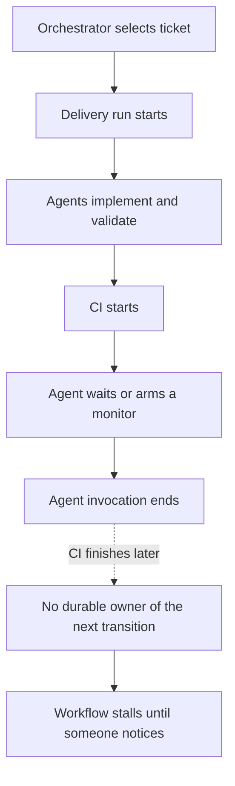
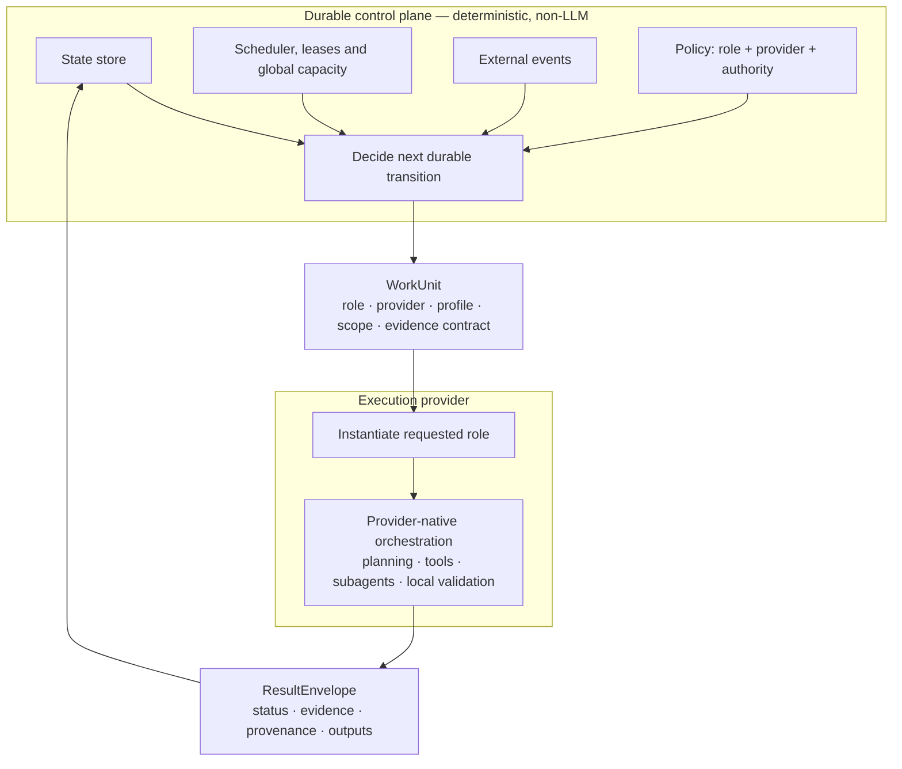
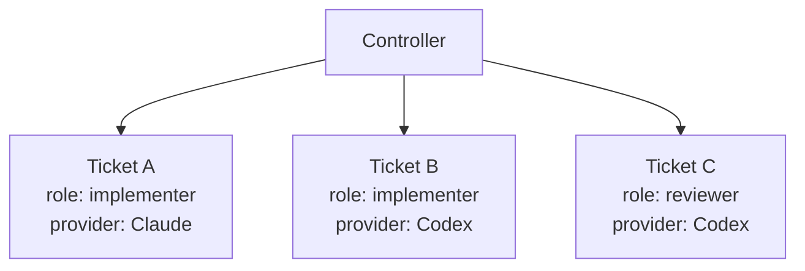
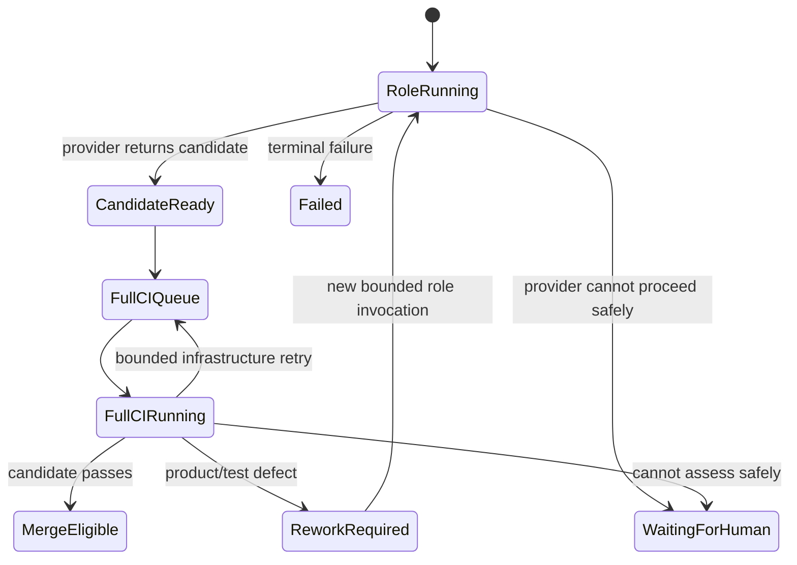
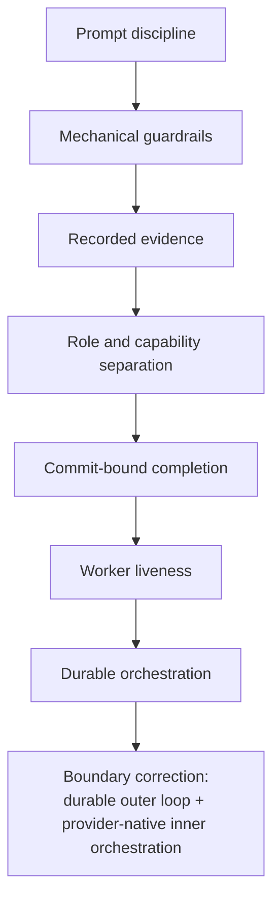

# From conversational loop to durable controller

> **Architecture update, 2026-09-19.** The core conclusion of this article still holds: workflow continuity, retries, external waits and authority must not depend on one long-lived agent conversation remembering to continue. What changed is the **lower boundary of the durable controller**.
>
> The controller should own durable workflow authority, semantic delivery roles and provider selection. Claude Code, Codex and future execution providers should remain free to use their native subagents, tools and internal orchestration inside a bounded role invocation.
>
> The earlier target architecture pushed the controller too far inward by treating implementation, review, diagnosis and specification as fine-grained controller-managed worker mechanics. That was an over-correction. The revised architecture keeps the durable outer loop while moving provider-native orchestration back behind a stable role/provider contract.

## The short version

Mechanical guardrails around agent work are necessary, but they are not sufficient if the workflow executing those guardrails depends on one long-lived conversation remembering to continue.

The harness originally concentrated on governing what agents did:

- acceptance contracts;
- deterministic gates;
- commit-bound review evidence;
- credential-isolated reviewers;
- three-outcome checks;
- diff budgets;
- eval ledgers;
- worker heartbeats.

Those mechanisms remain useful.

The operational system later exposed a different class of failure: **workflow liveness itself was conversational**. An orchestrator had to remember to re-arm its next wake-up, subagents could wait on CI and never get re-entered after the wait, and a crash could take the scheduler and its in-session watchdog down together.

The architectural rule remains:

> **An agent may decide how to perform a workflow transition. It should not be the durable authority deciding whether the workflow continues.**

That responsibility belongs to deterministic software with persisted state.

The refinement is equally important:

> **Moving workflow durability into deterministic software does not imply moving provider-native agent orchestration into it.**

The controller should decide **what role is required, which provider executes it, what authority it receives, what evidence it must return and what durable transition follows**.

The provider should decide **how that role is instantiated and whether native subagents, tools, internal planning or local review loops are used**.

## What changed in our understanding

The earlier work focused on a valid problem: an agent can be fluent and wrong while reporting green. The answer was to make claims mechanically checkable and to separate authoring capability from review capability.

That did not address a different question:

> If the current agent process or conversation disappears, who knows what should happen next?

For a simple interactive coding session, "the human restarts it" is a reasonable answer. For an autonomous delivery loop, it is not.

A system that can prove its checks but cannot reliably resume the workflow after a wait or crash is governed but not durable.

The first controller design correctly externalised workflow state, scheduling and recovery.

The implementation programme then started to externalise **too much of the cognitive workflow** as well. Implementer, reviewer, diagnosis and other agent activities increasingly became controller-managed runtime steps rather than semantic roles dispatched to an execution environment.

That was the wrong place to standardise.

The controller needs a stable **delivery contract**. It does not need to recreate Claude Code or Codex.

## The failure pattern remains real

A representative conversational shape looked like this:



A heartbeat does not fix that.

The worker may have reported a healthy heartbeat before it yielded. What is missing is **workflow durability across invocation boundaries**, not worker liveness.

| Mechanism | Question it answers |
|---|---|
| heartbeat | Is execution X still plausibly doing work Y? |
| provider runtime | How is this semantic role being executed right now? |
| controller | What durable workflow state exists, and what transition is allowed next? |

Conflating these creates one of two bad outcomes:

1. elaborate watchdogs around a conversational scheduler; or
2. an over-centralised controller that starts recreating the agent runtime.

## The revised architecture



The controller owns:

- durable workflow state;
- external reconciliation;
- retries and recovery;
- global leases and capacity;
- risk and authority policy;
- the semantic role required for a transition;
- provider selection;
- immutable input identity and evidence requirements;
- human gates;
- merge and deployment authority.

The controller does **not** need to own:

- Claude or Codex subagent creation;
- provider-specific session trees;
- prompt compaction strategies;
- provider-native planning mechanics;
- tool-call sequencing;
- internal worker/reviewer delegation when it remains inside one bounded invocation.

A provider invocation remains disposable. If it disappears, the durable workflow remains.

## Role is controller policy; subagent is provider implementation

The revised contract separates **semantic roles** from runtime entities.

A role is part of the delivery domain model and survives provider substitution:

- implementer;
- reviewer;
- architect;
- tester;
- specifier;
- diagnostician;
- closure/verifier.

A subagent is an implementation detail of a provider.

The controller may dispatch:

```text
WorkUnit
  ticket   = #123
  role     = reviewer
  provider = codex
  profile  = independent-review
```

Codex may execute that with one process, several subagents or a provider-native workflow. Claude Code may use a repository-defined reviewer agent and spawn specialist children. The controller does not need to model those mechanics.

The controller **does** enforce role-level policy. For example:

```text
security_change:
  requires architect
  requires implementer
  requires independent reviewer
  requires closure

independent_reviewer:
  cannot receive authoring credential
  cannot write product source
  may be required to use a different provider
```

This keeps ChatDev-like role topology where it is useful without hard-coding Claude- or Codex-specific runtime schemas into the controller.

## WorkUnit and ResultEnvelope

The provider boundary is deliberately coarse.

A `WorkUnit` should contain enough information for a provider to reconstruct the requested role from durable inputs without relying on conversational history:

```text
WorkUnit
- workflow / ticket identity
- immutable repository revision
- semantic role
- selected provider
- execution profile
- scope and allowed write surface
- acceptance criteria
- relevant durable decisions
- tool / authority envelope
- evidence contract
- budget / deadline
- parent provenance where applicable
```

A `ResultEnvelope` returns:

```text
ResultEnvelope
- work-unit identity
- terminal or handback status
- requested and actual provider/model/profile
- role actually executed
- resulting revision / PR / artifacts
- evidence references and hashes
- findings and disposition
- external wait identifiers, if any
- failure classification
- provenance for material nested activity
```

The crucial invariant is:

> **A provider result must be durably committed before a subsequent controller transition is dispatched.**

Internal subagent returns may be retained by the provider harness for observability and recovery, but the controller does not need to promote every internal agent exchange into first-class workflow state.

## Global concurrency versus local agent concurrency

The earlier architecture showed the controller directly running implementation, review and specification workers in parallel.

The revised design separates two different kinds of concurrency.

### Global delivery concurrency — controller-owned



The controller owns hard cross-run constraints such as:

| Capacity pool | Example slots |
|---|---:|
| active delivery roles | 2 |
| independent review roles | 2 |
| full CI | 2 |
| merge | 1 |

### Local execution concurrency — provider-owned

Inside one Claude or Codex invocation, the provider may use native subagents or internal parallelism within the authority and resource envelope supplied by the controller.

That means the controller can still say **"run a reviewer now, using Codex, under the independent-review profile"** without having to know whether Codex implements that role with one agent or five.

## What remains durable controller state

The durable boundary should be drawn around facts whose loss or ambiguity can change workflow correctness.

Examples that belong in the controller:

```text
READY
ROLE_RUNNING
WAITING_EXTERNAL
WAITING_HUMAN
CANDIDATE_READY
FULL_CI_RUNNING
REWORK_REQUIRED
MERGE_ELIGIBLE
SUCCEEDED
FAILED
```

Provider-internal states such as "reviewer spawned a specialist", "implementation subagent is fixing test 4" or "architect is compacting context" do not normally need to become controller states.

This reduces the distributed state machine while preserving durability where it matters.

## The review/CI cascade

The same architecture problem appeared around CI.

The useful durable boundary is:



Inside `RoleRunning`, a provider may perform implementation, local validation, native review and closure according to the requested role/profile.

A changed commit never inherits prior commit-bound evidence. Infrastructure failures may return directly to the CI queue under a bounded retry policy. An unclassifiable result fails closed.

## Reviewer identity and independence still matter

The durable-controller rearchitecture does not weaken reviewer isolation.

Review evidence is trusted because it was produced by a capability the author does not possess, its provenance can be verified, and it is bound to the exact commit being judged.

The revised architecture makes the policy clearer:

- the controller decides that an independent reviewer role is required;
- the controller may require a different provider or capability profile;
- the provider executes that semantic role with its native mechanisms;
- the controller evaluates the returned evidence and authority, not the shape of the provider's internal agent tree.

A literal login string remains too weak to prove authority. Capability/provenance is the security property.

## Rule-based provider/model routing

Provider choice remains controller policy because it affects cost, trust, capability diversity and operational constraints.

The controller may decide:

```text
role=implementer provider=claude profile=normal
role=reviewer    provider=codex  profile=independent-review
role=architect   provider=claude profile=deep-reasoning
```

What should not be standardised in the controller is the provider's internal subagent implementation.

The controller records requested and actual provider/model/profile and material provenance. The provider harness enforces provider-specific model/tool configuration and reports what actually ran.

This retains genuine cross-provider diversity without reducing all runtimes to the lowest common denominator.

## The human boundary remains risk-based

A durable controller makes human intervention easier to model explicitly rather than leaving it as an accidental stall.

| Risk class | Example | Human approval |
|---|---|---|
| low | docs, tests, internal tooling | normally no |
| ordinary | product code with established deterministic evidence | potentially no |
| high | auth, security, migrations, unattended actions | yes |
| control plane | scheduler, gates, reviewer policy, identity, CI/deploy policy | mandatory |

An autonomous system should not be able to weaken the rules that judge a change and immediately benefit from the weakened rule. A control-plane PR should be evaluated under the base branch's policy and require stronger authority.

That is a trust boundary, not a temporary compromise on the way to "full autonomy".

## What the earlier deep dives still support

The earlier claims remain intact:

| Claim retained | Why it still matters |
|---|---|
| An agent's green result is not enough evidence. | Provider-native orchestration does not make self-attestation trustworthy. |
| Review evidence must be bound to the exact commit. | The controller still owns durable authority and evidence evaluation. |
| A second agent can add useful review without being an independent audit. | Role and provider diversity must still be measured, not assumed. |
| Missing evidence is `could-not-assess`, not pass. | The durable controller must fail closed at authority boundaries. |
| Deterministic evidence is stronger than agent self-report. | Provider outputs remain claims until checked against evidence. |

## What the heartbeat pattern now means

The companion heartbeat pattern remains useful, but with a narrow contract:

> Heartbeats monitor or renew **execution leases**. They do not provide **workflow durability**.

If a provider invocation is doing a 20-minute local test run, a deadline-based beat is useful evidence that its lease should remain valid.

If the workflow is waiting for external CI, the provider should normally return. The controller records the CI run identity and owns the later transition.

## What the implementation work still proves

The existing implementation work is not discarded by this refinement.

The durable controller has already established useful primitives:

- project-neutral controller core and OpsWarden adapter separation;
- persisted decisions;
- bounded ticks;
- systemd-supervised execution;
- named capacity pools;
- structured outcomes;
- credential-isolated worker transport;
- fail-closed missing-credential behaviour;
- unlinked EnvironmentFile transport;
- review/provenance and merge-policy work.

The 2026-09-19 credential-transport proof is specifically reusable: the controller/provider boundary can transport protected worker credentials into a transient service while child processes receive disjoint, from-scratch environments.

What changes is the **unit of dispatch and the amount of internal execution state the controller needs to model**.

## OpsWarden first, extraction later

The generic controller package is currently developed inside the OpsWarden repository.

The immediate goal is to prove the revised architecture end to end against OpsWarden before performing repository extraction.

This avoids combining two risky changes:

1. correcting the controller/provider boundary; and
2. moving the generic package into a new repository and project board.

The extraction criterion should be evidence-based: once the revised role/provider boundary completes a representative OpsWarden delivery cycle without OpsWarden leakage into the generic core, extraction can become its own programme with a new board.

The detailed implementation architecture is maintained with the product code in a private repository and is intentionally not linked from this public article.

## Do we need Temporal?

Not necessarily.

The durable outer-loop requirements remain modest enough to prove with the current controller: persistence, retries, timers, leases, admission and external reconciliation.

A workflow engine such as Temporal may become attractive if those requirements expand. It should replace understood infrastructure, not compensate for an unnecessarily fine-grained controller state machine.

The revised provider boundary actually reduces the case for introducing a heavier workflow engine early because fewer cognitive micro-transitions need durable orchestration.

## What the rearchitecture taught us

The harness evolved through several boundaries:



None of the earlier layers became useless when the next one appeared.

The durable-controller step solved a real problem, but the first target architecture pushed the control plane too far into provider execution mechanics.

The corrected rule is:

> **Use the controller for durable authority, semantic role policy, provider selection and cross-run coordination. Use execution providers for intelligence, native subagents and session mechanics.**

A production agentic delivery system needs both:

- a durable deterministic outer workflow;
- provider-native intelligent execution behind a stable role/provider contract.
