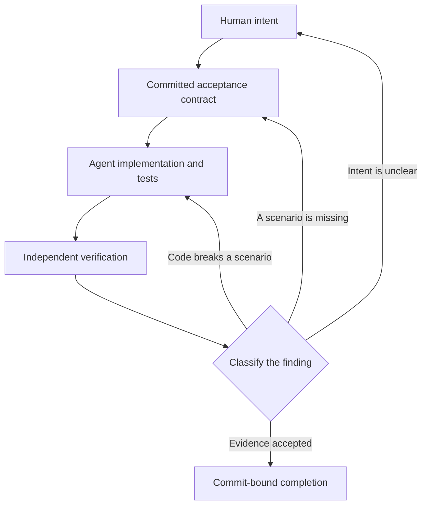

# Governing the double loop when the developer is an agent

> A case study in turning acceptance-test-driven development from a human
> discipline into a governed protocol. Some parts are deterministic gates;
> others still depend on review. That distinction matters when the developer
> running both loops is a coding agent that can misread the requirement, weaken
> its tests, declare victory early, and edit some of the evidence used to judge
> its work.

## What this is, and what it is not

The double loop is not ours. An outer acceptance test guides an inner unit-test
loop, after which the developer returns to the outer test and refactors on green.
Freeman and Pryce, Dan North, Gojko Adzic and others established these ideas long
before coding agents.

Published work has also explored TDD, BDD and acceptance-test-driven development
with coding agents, including the risks of letting one agent write both the tests
and the implementation. We discovered several of these articles while preparing
this case study, after the system and controls described here had already been
developed. Their findings overlap with our experience in useful ways and also
expose limits in what our evidence can support.

This case study focuses on a narrower operational problem: how to govern two
nested test loops when agents can change the implementation, the acceptance
contract and much of the evidence used to judge their work. It describes the
controls we used, where those controls were incomplete, and what the delivery
record can—and cannot—tell us about the results.

None of the failures below is unique to agents. Humans game tests, skip steps,
assume premises and misdiagnose problems too. Agents change the risk profile:
they can repeat those behaviours quickly, confidently and across many tasks.

The contribution here is one worked example from a real system. Some controls
were deterministic CI or orchestration gates. Others were required reviews or
working rules. Calling both “mechanically enforced” would overstate the evidence,
so the article identifies which is which. Identifiers have been stripped and
internal text paraphrased, but the case and figures come from recorded delivery
history.

## The governance shape

The familiar double loop needs an extra decision point when an agent can edit both
the code and the contract used to judge it:

The classification has three outcomes:

- **Implementation defect:** the code violates an existing scenario. Fix the code.
- **Acceptance-contract gap:** expected behaviour has no scenario. Expand the
  contract, then test the code against it.
- **Requirement ambiguity or change:** the intended behaviour is unclear. Return
  to the human rather than letting the agent guess.

The work item used as the basis of this article shows the first two. The wider
workflow also uses the third when an agent cannot safely determine intent, but
that did not happen in this example.

Not every arrow is mechanically enforced. The main controls are:

| Transition | Control | Evidence |
|---|---|---|
| intent → contract | work cannot advance without a committed spec | spec and executable scenarios |
| contract → implementation | diff budget with an attributed exception path | changed files, size and interventions |
| implementation → verification | required review; the stronger, later design uses a restricted reviewer identity | verdict and inspected commit |
| finding → code or contract | tests and review run again after changes | new commit, scenarios and verdict |
| ambiguity → intent | human clarification or approval | amended requirement |
| verification → done | approval must apply to the current commit | commit-bound completion record |

The important distinction is between a deterministic gate and a required review.
For example, no rule prevents the author from editing a `.feature` file, so the
quality of that change still depends on review.

## Failure modes that matter more with agents

The harness records detected mistakes and who first caught them. Over the logged
window, it contains 111 agent-error records:

| Failure kind | Count | Meaning |
|---|---:|---|
| premise not checked | 32 | acted on an unconfirmed assumption |
| process step skipped | 31 | omitted a required spec, scenario or review step |
| unverified claim | 35 | stated a repository, CI or workflow fact without checking it |
| wrong diagnosis | 7 | named a cause without enough evidence |
| fabricated detail | 6 | invented a path, name or number |

Across the same records, the first catcher was the implementing agent in 40 cases,
a tool in 26, another agent in 23 and a human in 22.

These failures are not unique to agents. **What changes with an agent is how often,
how convincingly and at what scale they can happen.** An agent can make an
unsupported claim, accept it as evidence and repeat the pattern across many tasks.

**A human was the first to catch 20% of the logged mistakes, but this is not an
industry benchmark or a measure of overall defect detection.** It means 22 of 111
recorded, detected mistakes relied on human oversight. Some human involvement is
intentional, particularly for intent and risk decisions. The improvement target
is narrower: reduce repeatable technical mistakes that tests, deterministic
checks or independent review could catch earlier.

## The case study: a false green, and the gate built to stop the next one

### The origin: an outer loop quietly stripped of tests

An earlier configuration error matched excluded directories by basename rather
than full path and silently removed 87 backend tests from collection. Other tests
still ran and passed, so CI stayed green. The problem was not an empty suite; it
was a large drop in the number of tests collected.

A maintainer familiar with the suite might notice the drop. A newly dispatched
agent sees a green result and has no memory that the suite used to be larger.

### The requirement: make the absence loud

The requirement was simple: fail CI when a suite reports fewer tests than a
committed floor, and name the difference.

The floor changes only in an explicit, reviewed diff and is never lowered
automatically. Otherwise the guardrail could ratify the loss it exists to catch.
The floor detects a shrinking reported test population; it does not detect tests
that are still reported but skipped at runtime or made vacuous.

### The outer loop: acceptance scenarios first

A committed design spec and four executable Gherkin scenarios preceded the
implementation: below the floor fails with the floor, actual count and gap;
exactly at or above the floor passes; and a suite with no configured floor reports
could-not-assess.

The first contract did not cover a missing, empty or malformed test report. That
gap matters later. The scenarios were bound to pytest-bdd step definitions, so
green meant they ran—not merely that someone approved the prose.

Nothing prevented the authoring agent from editing its own feature files. In this
historical case, a fresh-context reviewer challenged the contract under the same
repository identity. Separate commit-bound review and final approval added more
checks, but full reviewer credential isolation came later.

### The inner loop: tests against real fixtures

The implementation used two CLI checkers: one read backend JUnit XML and the other
frontend JSON. Tests exercised real files through subprocesses, and a separate
wiring test checked that CI invoked each checker with the right report.

The tests passed, but the history does not prove that every test was observed
failing for the intended reason before implementation. This case therefore cannot
show that the TDD ritual itself caused the result. Its useful evidence begins when
review challenges the green implementation.

### The interesting moment, part one: review finds an acceptance-contract gap

A fresh-context review agent found that the four scenarios covered low test
counts but not an absent, empty or malformed report. This was an important gap:
a report may be missing because the test step never ran, which was closely related
to the failure the new guardrail was meant to prevent.

The contract was expanded with scenarios for those cases, followed by one for an
unreadable floors file. The inner tests had already passed, but review showed that
the outer contract was incomplete. This is the first branch in the classification:
the expected behaviour was clear, but no scenario pinned it.

### The interesting moment, part two: the new scenario exposes a code defect

The missing-report scenario then exposed a defect. The checker exited non-zero,
but silently treated the absent report as a count of zero and printed the generic
advice to lower the floor. That diagnosis was wrong: lowering the floor would hide
the fact that the test step had never produced a report.

The new scenario required the message to name the missing report, and it failed
against the original checker. The fix separated an absent report from a genuinely
low count and reported the likely cause.

This is the second branch. First, review found a gap in the acceptance contract;
once the scenario existed, the code failed it and the problem became an
implementation defect. The sequence matters more than either defect on its own:
challenging the outer contract exposed a problem that the original green run had
missed.

### What “external review” meant in this case

“External” meant outside the authoring context, not one uniform security boundary:

- a fresh-context agent found the central contract gap but shared the author's
  repository identity;
- a separate connector inspected a specific commit and raised other findings;
- a human invoked a separate grantor identity for final approval.

The stronger architecture came later: a restricted CI reviewer publishes a
verdict bound to the head commit, and a missing verdict blocks completion.

Credential, context and model separation solve different problems. Only credential
isolation is a permission boundary; none makes the reviewer infallible. The
cookbook describes the later implementation, while this article keeps the weaker
historical sequence visible.

### The case study in one table

| Stage | Evidence |
|---|---|
| Requirement | Fail CI when a suite falls below its committed test-count floor. |
| Initial contract | Four executable scenarios covered below, equal, above and unconfigured floors. |
| Contract gap | Review found no scenario for a missing, empty or malformed report. |
| Added contract | New scenarios covered those states and an unreadable floors file. |
| Defect exposed | The checker failed but gave the dangerous advice to lower the floor when the report was missing. |
| Fix | The checker now distinguishes a missing report from a low count and names the cause. |
| Completion | Commit-bound review, final approval, four CI runs and two change-requesting reviews were recorded. |
| Hardening | The collection-floor check now runs in CI and its design rule is recorded. |

## What this case study does *not* show

The example demonstrates an acceptance-contract gap followed by an implementation
defect. It does not demonstrate requirement ambiguity; intent was clear in this
work item, although the wider workflow has returned other work to humans for
clarification.

The historical record also has limits:

- it shows green CI, not a verified red-before-green sequence;
- it cannot show that procedural TDD caused the improvement;
- 131 change-requesting reviews show that review found more work, not that an
  outer test failed after an inner green;
- there is no no-TDD control group; and
- the reviewer that found the missing scenario had fresh context but shared the
  author's repository identity.

The strongest supported claim is narrower: challenging and widening an executable
contract exposed a real defect.

## The aggregate: what a few hundred runs show

The ledger snapshot contains **334 work-item runs**: 318 delivery runs and 16
separately recorded review-worker runs from the earlier workflow. That second
number is not a count of every external review or Codex review; it is the
`run_kind=review` population stored in the ledger. Delivery-agent rates use 318
as their denominator, because mixing in those always-clean review-worker rows would
flatter them. Exact definitions and counts are in the shared
[metrics snapshot](../evidence/metrics-snapshot.md).

| Signal | Recorded result | What it does—and does not—mean |
|---|---:|---|
| Change-requesting review | 131 of 318 delivery runs | Review found more work after the agent considered itself done; not proof of an outer-loop failure. |
| CI runs on the head commit | one 62.6%; two 17.6%; three or more 19.8% | Workflow activity, including retriggers; not attempts to reach green. Mean 2.0. |
| Clean delivery runs | 56.9% | The rest needed recorded human steering; severity and purpose vary. |
| Guardrail exceptions | 44 runs, 46 exceptions | Overrides were visible and attributed; 27 concerned the diff budget. |
| Recorded reverts | 0 of 334 | Weak evidence: the field was manual and had no automated observation window. |
| Agent tokens | about 222,000 per delivery over 51 measured runs | Partial cost data, not a complete population. Twelve separately recorded review-worker runs averaged about 79,000. |

One outlier had 68 CI runs because infrastructure problems triggered repeated
manual reruns. It is exactly why raw CI activity should not be presented as
rework.

The 20% human-first catch rate comes from 111 logged, detected mistakes, not all
mistakes. There is no industry baseline, and lower is not automatically better:
the current ledger mixes necessary clarification and risk decisions with
preventable human rescue.

Future reporting should separate those categories. Repeated technical failures
should become tests or deterministic checks where practical; premise errors
should strengthen evidence requirements; and gaps that cannot be automated should
improve review guidance. The target is not to remove humans from intent or risk
decisions, but to stop relying on them for repeatable technical catches.

## When the reviewer is also an agent

The harness later added an autonomous CI reviewer under its own restricted
identity. It has found issues that delivery agents missed, but another agent is
not automatically an independent judge.

Three kinds of separation matter:

- **Credential isolation:** the reviewer cannot push as the author, and its
  commit-bound verdict cannot be forged by the author.
- **Context isolation:** a fresh context is less anchored to the author's
  reasoning, but this is not a security boundary.
- **Model or persona separation:** different instructions or models may reduce
  shared blind spots, but offer no guarantee.

Deterministic gates still work if author and reviewer share an identity. What
collapses is independent judgement over everything those gates cannot assess.
The defensible position is therefore modest: agent review adds a useful layer
when permissions and evidence are separated, but it is not an independent audit.

## What we plan to improve

The related work does not justify adding more TDD instructions and assuming the
problem is solved. It suggests a small set of testable improvements:

1. Compare the full double-loop workflow with streamlined variants on matched
   application-feature work. Keep inner TDD mandatory in every feature condition;
   vary the surrounding ATDD guidance, task-specific test context and review
   controls. Evaluate work where TDD is genuinely not applicable separately,
   rather than using it as evidence for removing TDD from feature delivery.
2. Check that a claimed red step failed for the intended reason. Where that
   evidence cannot be reproduced, describe red-before-green as a working rule,
   not an enforced fact.
3. Tighten the Gherkin guidance: one behaviour per scenario, observable outcomes,
   little UI coupling, no placeholders, and explicit negative or uncertain paths.
   Executable Gherkin can still be vague or vacuous.
4. Give agents task-specific code-to-test context where practical, while keeping
   the full regression suite in merge CI. Focused test selection is an aid to the
   inner loop, not a replacement for broad verification.
5. Keep regression and escaped-defect measurement separate from activity metrics
   such as CI runs and review rounds.

These changes are tracked in the source system's backlog. We will publish what
the comparison supports, including a result that a simpler surrounding workflow
performs just as well. For application features, “simpler” does not mean removing
the inner TDD loop.

## Practical lessons

If you are building an agent harness and reaching for ATDD, the reusable claims
are these:

1. **An agent's green is insufficient evidence.** It does not establish collection
   completeness, contract quality, or that the reviewed commit is the one merged.
2. **Separate the author from the judgement where you can.** Context separation,
   credential isolation and model separation solve different problems; name the
   one you actually have.
3. **Treat “could not assess” as a first-class outcome.** A missing report must
   never quietly become a pass or an ordinary low count.
4. **Bind review evidence to a commit.** Approval that floats free of a SHA can be
   inherited by code the reviewer never saw.
5. **Measure outcomes and overhead.** Review rounds and CI runs show activity, not
   causal benefit. Track escaped defects, regressions, intervention and cost.
6. **Keep the contract open to challenge.** Here, review widened the executable
   contract and the new scenario exposed a real defect. That is the strongest
   result the evidence supports.

The double loop remains useful as a way to structure delivery. When an agent runs
it, the practical work is deciding which parts need deterministic gates, which
still depend on review, and how to test whether the extra ceremony improves the
software.

## References

Foundational work:

- Steve Freeman & Nat Pryce, *Growing Object-Oriented Software, Guided by Tests*.
  <http://www.growing-object-oriented-software.com/>
- Dan North, *Introducing BDD*. <https://dannorth.net/introducing-bdd/>
- Gojko Adzic, *Specification by Example*.
  <https://gojko.net/books/specification-by-example/>

Agent-focused work discovered while preparing this article:

- Birgitta Böckeler, *TDD in the Agent Loop*. Her exploratory comparison found no
  clear quality benefit from adding TDD instructions and showed agents skipping
  or compressing the red step. That is why procedural TDD is not treated as a
  proven cause here.
  <https://martinfowler.com/articles/exploring-gen-ai/tdd-in-the-agent-loop.html>
- Emily Bache, *Test-Driven Development with Agentic AI*. Her experience with
  test lists, outer acceptance tests, harness rules and mutation testing overlaps
  with the direction of this case.
  <https://coding-is-like-cooking.info/2026/03/test-driven-development-with-agentic-ai/>
- Paul Duvall, *ATDD-Driven AI Development*. This is a useful parallel for using
  Gherkin and CI to steer AI delivery, so this article does not claim that pairing
  as novel.
  <https://www.paulmduvall.com/atdd-driven-ai-development-how-prompting-and-tests-steer-the-code/>
- Andy Knight, *BDD & Gherkin Guidelines for AI Coding and Testing*. The warning
  that generated scenarios can be vague, UI-heavy or cover several behaviours at
  once informs the planned contract-guidance audit.
  <https://automationpanda.com/2026/04/27/bdd-gherkin-guidelines-for-ai-coding-and-testing/>
- *Test-Dependency Aware Development*. Its evaluation on a smaller local model
  found that procedural TDD prompting increased regressions, while graph-derived
  code-to-test context reduced them. The model, language and sample limit how far
  that result can be generalised, but it gives us a concrete experiment to run.
  <https://arxiv.org/abs/2603.17973>

The enforcement mechanisms referenced above are written up as small standalone
patterns in the companion cookbook:

- [review-evidence-commit-binding](https://github.com/msbi-ltd/agentic-harness-cookbook/blob/main/patterns/review-evidence-commit-binding.md), binding a review verdict to the exact head commit.
- [reviewer-isolation](https://github.com/msbi-ltd/agentic-harness-cookbook/blob/main/patterns/reviewer-isolation.md), a reviewer identity that publishes a commit status the author can't forge.
- [script-three-outcome-contract](https://github.com/msbi-ltd/agentic-harness-cookbook/blob/main/patterns/script-three-outcome-contract.md), clean / failed / could-not-assess, and why the third must never become a pass.
- [diff-budget-escape-valve](https://github.com/msbi-ltd/agentic-harness-cookbook/blob/main/patterns/diff-budget-escape-valve.md), the size cap with a named, attributed exception.
- [mistake-ledger](https://github.com/msbi-ltd/agentic-harness-cookbook/blob/main/patterns/mistake-ledger.md), recording who caught each mistake, the load-bearing metric here.

A companion deep-dive, [Evals for an agent loop](honest-evals-for-an-agent-loop.md),
covers the measurement side and its own honesty problems.

---

*This is a case study from one system, not a methodology. Its authority, such as
it is, comes from showing the machinery, the mistakes and the trade-offs, the
numbers are from the harness's own ledger, and the failures are recorded, not
reconstructed. The full field definitions, taxonomy, report formulas and the
exact counts under every rounded figure are in the shared, versioned
[metrics snapshot](../evidence/metrics-snapshot.md), referenced by both deep-dives so they
can't drift apart. If a mechanism here would fail in your context, that is worth
an issue.*
